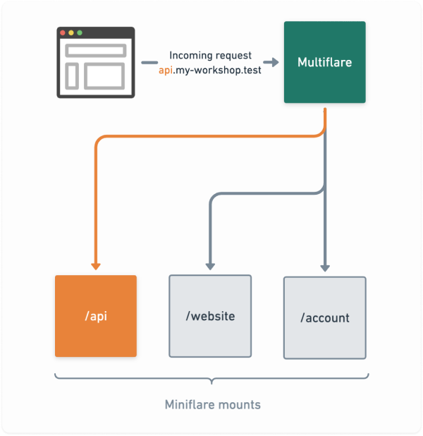

# multiflare

Run multiple simulated [Cloudflare Workers](https://workers.cloudflare.com/) in your project with `multiflare` utilizing [the amazing `miniflare`](https://v2.miniflare.dev/) and its [`mount` option](https://v2.miniflare.dev/mount.html#mounting-workers) 🚀

This is useful if you have a lot of workers to orchestrate; maybe even in a monorepo. The workers can have their individual configuration in their own `wrangler.toml`.

## 🤔 Motivation

Developing with multiple workers can be difficult, especially if you want to simulate near-production environment. Multiflare proxies requests from subdomains to a local worker.

Imagine having a project with a few workers looking like this:

- `www`: Static landing page
- `blog`: GraphQL powered blog
- `chat`: Live chat worker with durable object
- `api`: Some other endpoints

Now you are able to access the workers like so:

<table>
  <tr>
    <td>Production via Cloudflare
    <td>Development via <code>multiflare</code>
  </tr>
  <tr>
  <td>

- `www.multiflare.io`
- `blog.multiflare.io`
- `chat.multiflare.io`
- `api.multiflare.io`
<td>

- `www.multiflare.test`
- `blog.multiflare.test`
- `chat.multiflare.test`
- `api.multiflare.test`
</table>



All these workers can share KV, Durable Objects, cache etc.

Essentially everything [`miniflare` offers](https://v2.miniflare.dev/) can be used by `multiflare`:

> Miniflare is a simulator for developing and testing Cloudflare Workers.
>
> - 🎉 Fun: develop workers easily with detailed logging, file watching and pretty error pages supporting source maps.
> - 🔋 Full-featured: supports most Workers features, including KV, Durable
>   Objects, WebSockets, modules and more.
> - ⚡ Fully-local: test and develop Workers without an internet connection. Reload code on change quickly.

All code examples in this readme are based on [the example in this repository](https://github.com/dan-lee/multiflare/tree/main/example/multiflare/workers).

## 📥 Installation

Let's go! 👏

```sh
yarn add multiflare --dev

# or

npm install --save-dev multiflare
```

## 🧑‍🔧 Usage

Running `multiflare` is easy:

```sh
yarn multiflare ./example/multiflare/workers

# or with ES modules

NODE_OPTIONS=--experimental-vm-modules yarn multiflare ./example/multiflare/workers
```

It requires some setup though:

## 🔧 Setup

Put all your workers as subdirectory in a common directory with their respective `wrangler.toml` files. Like so:

```
multiflare/
└── workers
    ├── api
    │   ├── wrangler.toml
    │   └── …
    ├── website
    │   ├── wrangler.toml
    │   └── …
    └── account
        ├── wrangler.toml
        └── …
```

## 🔀 Add local domain handling

To simulate production environment it's useful to have a similar domain locally.

For example if your production domain is `multiflare.io` you can easily add `multiflare.test` domain to your local machine just to have a similar environment.

### Simple setup for pre-defined subdomains

Open and modify `/etc/hosts`:

```sh
# Append to file
127.0.0.1 multiflare.test www.multiflare.test
127.0.0.1 api.multiflare.test
127.0.0.1 blog.multiflare.test
127.0.0.1 chat.multiflare.test
```

<details>
<summary><b>Advanced setup for any domain (catch all)</b></summary>

This describes the case for all `*.test` domains:

1. Install [`dnsmasq`](https://thekelleys.org.uk/dnsmasq/doc.html): `brew install dnsmasq` (installation differs depending on your system)
2. Add following line to `/usr/local/etc/dnsmasq.conf`:

```
address=/test/127.0.0.1
```

3. Add following to `/etc/resolv.conf`

```
search test
nameserver 127.0.0.1
```

4. Add file `/etc/resolver/test` with this line `nameserver 127.0.0.1`
</details>

### Configure `wrangler.toml` of the workers

Put your domain(s) into the `[env.dev]` section, so `multiflare` is able to pick it up.

`…/api/wrangler.toml`:

```toml
name = "api"

# 👇 This is key
[env.dev]
route = "api.multiflare.test/*"

[env.production]
route = "api.multiflare.io/*"
```

`…/website/wrangler.toml`:

```toml
name = "website"

# 👇 This is key
[env.dev]
routes = ["multiflare.test/*", "www.multiflare.test/*"]

[env.production]
routes = ["multiflare.io/*", "www.multiflare.io/*"]
```

**Now you should be ready to run `multiflare`! 👌**

```sh
yarn multiflare ./example/multiflare/workers

# or with ES modules

NODE_OPTIONS=--experimental-vm-modules yarn multiflare ./example/multiflare/workers
```

Phew! That was a lot to take in. If you have any questions or something is not clear, please feel free to open an issue.

## CLI

```
Arguments:
  directory                Root directory of workers.

Options:
  --https                  Serve via HTTPS. Be sure to also set --key and --cert
  --key <key>              Path to key file
  --cert <cert>            Path to cert file
  -p, --port <port>        Port where to serve from. Default: 80 for HTTP, 443 for HTTPS
  -l, --log-level <level>  Log level: none, error, warn, info, debug, verbose (default: "info")
  -h, --help               display help for command
```

## API

Types:

```ts
export type MultiflareOptions = {
  rootDir: string
  https?: string
  key?: string
  cert?: string
  port?: string
  logLevel?: 'none' | 'error' | 'warn' | 'info' | 'debug' | 'verbose'
}

declare const multiflare: (options: MultiflareOptions) => Promise<{
  stop: () => Promise<unknown>
  server: import('http').Server | import('https').Server
  miniflare: Miniflare
}>

export default multiflare
```

Example usage:

```ts
import multiflare from 'multiflare'

const { stop } = await multiflare({
  rootDir: './workers',
})

// later in time:
await stop()
```
